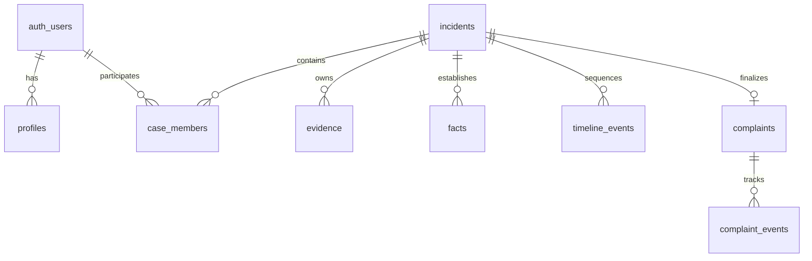

# CyberDesk — System Architecture & Technical Specifications

CyberDesk is an India-focused Civic Incident Desk prototype designed to help citizens transform raw, confusing cyber incidents (financial fraud, identity impersonation, extortion, phishing) into an organized, evidence-backed Incident Dossier.

---

## 1. System Overview

```
                          CITIZEN / BROWSER
                                 │
           ┌─────────────────────┴─────────────────────┐
           ▼                                           ▼
[Unauthenticated Civic Demo]              [Authenticated Case Workspace]
  • Guided 9-Step Intake Flow               • Passwordless Supabase Magic Link
  • Educational Simulation                  • Multi-Case Workspace Dashboard
  • Real-time Deterministic Fallback        • Private Evidence Cloud Vaulting
                                                       │
                                                       ▼
                                         [Next.js App Router (15.5)]
                                         Server API Route Handlers
                                                       │
                                   ┌───────────────────┴───────────────────┐
                                   ▼                                       ▼
                       [AI Integration Layer]                  [Supabase Backend Layer]
                         • OpenAI Structured JSON Output         • PostgreSQL Database
                         • Prompt Injection Defense Boundaries   • Row-Level Security (RLS)
                         • Sensitive Credential Filtering        • Private Storage Bucket
                         • Deterministic Regex Fallbacks         • Multi-User Case Membership
```

---

## 2. The AI Trust Boundary

The core differentiator of CyberDesk is that **AI output is never treated as authoritative fact**.

```
   ┌────────────────────────────────────────────────────────┐
   │ 1. CITIZEN INPUT                                       │
   │    Raw narrative description or uploaded evidence file  │
   └───────────────────────────┬────────────────────────────┘
                               │
                               ▼
   ┌────────────────────────────────────────────────────────┐
   │ 2. AI CANDIDATE EXTRACTION (Untrusted Boundary)        │
   │    • Structured JSON extraction (OpenAI Responses API) │
   │    • Sensitive credential filter (strips OTP/PIN/PAN)  │
   │    • Labeled explicitly as "AI suggestion" (Candidate) │
   └───────────────────────────┬────────────────────────────┘
                               │
                               ▼
   ┌────────────────────────────────────────────────────────┐
   │ 3. CITIZEN VERIFICATION (Human-in-the-Loop)            │
   │    Citizen inspects each candidate field:              │
   │    [CONFIRM]  ──  [EDIT & CONFIRM]  ──  [REJECT]       │
   └───────────────────────────┬────────────────────────────┘
                               │
                               ▼
   ┌────────────────────────────────────────────────────────┐
   │ 4. AUTHORITATIVE PERSISTENCE                           │
   │    • Confirmed fields stored with provenance metadata  │
   │    • Rejected fields omitted from official timeline    │
   │    • System generates structured, chronological Dossier│
   └────────────────────────────────────────────────────────┘
```

### Safety Invariants:
1. **No Auto-Promotion**: Candidate fields may be retained as extraction metadata, but only explicitly confirmed fields are written to the real `facts` table.
2. **Provenance Tracking**: Every fact maintains an origin tag (`openai`, `demo_fallback`, `citizen`, `synthetic`) and timestamp.
3. **Sensitive Field Protection**: `isRestrictedEvidenceValue()` removes credential/account-like candidate values, while `redactSensitiveText()` protects raw narratives before AI use and persistence. Valid Indian phone numbers remain usable.

---

## 3. Data Model & PostgreSQL Row-Level Security

CyberDesk uses 8 relational tables with strict Row-Level Security policies:



### Table Specifications:
- `incidents`: Core incident record (`id`, `incident_type`, `description`, `urgency`, `status`, `is_demo`, `created_by`).
- `case_members`: Multi-user ownership & collaboration (`incident_id`, `user_id`, `role: owner | collaborator | viewer`).
- `evidence`: File records and candidate extraction states (`category`, `mime_type`, `upload_status`, `storage_reference`).
- `facts`: Verified evidence-backed facts (`fact_type`, `value`, `source`, `verification_status`, `provenance`).
- `timeline_events`: Chronological synthesized sequence (`event_key`, `event_time`, `event_time_label`, `time_precision`).
- `complaints`: Finalized citizen complaint text and formal reference ID (`acknowledgement_id`).
- `complaint_events`: Immutable audit trail of case status progression.
- `profiles`: User account details auto-synchronized from `auth.users` via trigger.

### Row-Level Security Rules:
- **Demo Isolation**: Records with `is_demo = true` are public and read-only for anonymous users, completely isolated from real citizen cases.
- **Case Membership**: Real records (`is_demo = false`) are readable only by members. Real mutations are server-only after API role checks; authenticated direct mutation grants are revoked.
- **Identity Immutability**: PostgreSQL triggers protect `is_demo`, `created_by`, case relationships, and derived evidence relationships.

---

## 4. Private Storage Vaulting

Evidence files are stored in the private Supabase Storage bucket `cyberdesk-evidence`:
- **Deterministic Path Structure**: `cases/<incident-uuid>/<evidence-uuid>/<sanitised-filename>`
- **Storage Policy**: `is_case_storage_path(name)` requires exactly `cases/<incident UUID>/<evidence UUID>/<sanitised filename>`, verifies the member case, and verifies the evidence row belongs to that case.
- **File Validation**: Restricted to PNG, JPG, JPEG, PDF, and TXT with a strict 5 MB per-file size ceiling.

---

## 5. Multilingual Localization Architecture

CyberDesk supports 5 major Indian languages natively without runtime external translation APIs:
- **English** (`en`)
- **हिंदी — Hindi** (`hi`)
- **বাংলা — Bengali** (`bn`)
- **தமிழ் — Tamil** (`ta`)
- **తెలుగు — Telugu** (`te`)

All emergency helpline numbers (`1930`, `cybercrime.gov.in`) and transaction invariant codes remain preserved across all translations. Language choice is persisted across sessions in `localStorage` and `cookie`.

---

## 6. Deployment & Scalability Path

- **Tier 1 (Current Prototype)**: Dual-mode Next.js 15 App Router deployment on Vercel with serverless Supabase PostgreSQL and OpenAI Structured Output APIs.
- **Tier 2 (Campus / Pilot)**: Dedicated Supabase instance, Upstash Redis rate-limiting, SHA-256 evidence integrity hashing.
- **Tier 3 (State / Regional Desk)**: Regional database partitioning by Police Zone / State, immutable audit log table, officer triage console.
- **Tier 4 (National Scale)**: Integration with Citizen Service Centers (CSCs), DigiLocker identity verification, and multi-region failover.
